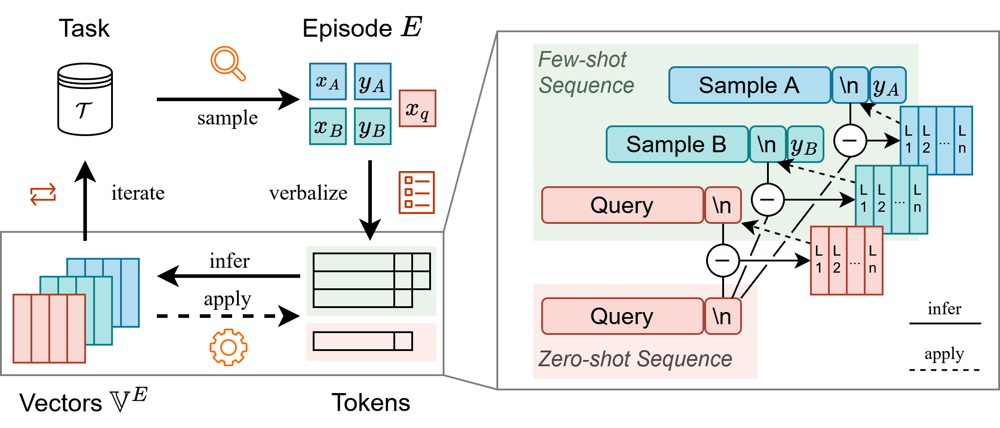

# Iterative Vectors

**Iterative Vectors: In-Context Gradient Steering without Backpropagation**

> Yiting Liu, Zhi-Hong Deng<br/>ICML 2025



Iterative Vectors (IV) introduces a novel approach for enhancing in-context learning in large language models. By directly editing activations using simulated gradients, IV achieves significant performance improvements across various tasks, critically *without* requiring traditional backpropagation.

## Quickstart

To get started with Iterative Vectors, follow these steps:

1.  **Environment Setup:**
    Set up your development environment using Conda:
    ```sh
    conda env create -n <name> -f env.yaml
    ```

2.  **Configuration File:**
    Create a configuration file (e.g., `config/yours.yaml`) specifying the tags or paths to your language models:
    ```yaml
    models:
      llama-2-7b: meta-llama/Llama-2-7b
      llama-2-13b: /or/use/path/instead/llama-2-13b-hf
      llama-2-70b: ...
      llama-3.1-8b: ...
      gpt-j-6b: ...
    ```

3.  **Run Evaluation:**
    To evaluate Iterative Vectors with a specific set of hyperparameters on, for instance, GPU ID 0, execute the following command:
    ```sh
    python iv.py -c config/yours.yaml -g 0 -m llama-2-7b -t ag_news -s 4 --strength 0.5 --ext-strength 0.3 --run-test
    ```

## Scripts

Please consult `scripts.sh` for comprehensive guidance on finding optimal hyperparameters for IV, as well as instructions for running Task Vectors and Function Vectors.

> [!TIP]
> To speed up dataset loading, set `HF_DATASETS_OFFLINE=1` *after* you have pre-cached all necessary datasets.
>
> Additionally, setting `PYTHONWARNINGS="ignore::DeprecationWarning"`, `DATASETS_VERBOSITY=error`, and `TRANSFORMERS_VERBOSITY=error` is recommended to reduce verbose log output during execution.

## Citation

If you find Iterative Vectors useful for your research, please cite our paper:

```bibtex
@inproceedings{liu2025IterativeVectors,
  title={Iterative Vectors: In-Context Gradient Steering without Backpropagation},
  shorttitle = {Iterative Vectors},
  booktitle = {Forty-Second International Conference on Machine Learning},
  author = {Liu, Yiting and Deng, Zhi-Hong},
  year = {2025},
  urldate = {2025-06-20},
  url={https://openreview.net/forum?id=1v3XEcRMyP}
}
```
